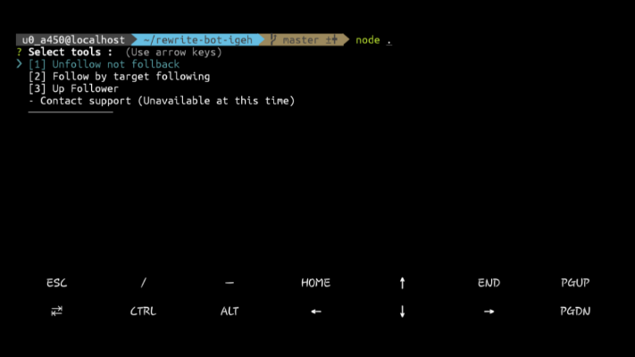

# bot-igeh
> Bot Instagram.

[![NPM Version][npm-image]][npm-url]

One to two paragraph statement about your product and what it does.



## Installation

Termux:

```sh
git clone https://github.com/ZefianAlfian/rewrite-bot-igeh
cd rewrite-bot-igeh
npm install
```

## Meta

Rizqi – [@mrizqirmdhn_](https://instagram.com/mrizqirmdhn) – tryaha78@gmail.com

[https://github.com/ZefianAlfian/rewrite-bot-igeh](https://github.com/ZefianAlfian/)

## Contributing

1. Fork it (<https://github.com/ZefianAlfian/rewrite-bot-igeh/fork>)
2. Create your feature branch (`git checkout -b feature/fooBar`)
3. Commit your changes (`git commit -am 'Add some fooBar'`)
4. Push to the branch (`git push origin feature/fooBar`)
5. Create a new Pull Request

## Special thanks

- [Andi Muh. Rizqi](https://github.com/ikiganteng/bot-igeh). Thanks to him for starting it.

<!-- Markdown link & img dfn's -->
[npm-image]: https://img.shields.io/npm/v/datadog-metrics.svg?style=flat-square
[npm-url]: https://www.npmjs.com/package/instagram-private-api
